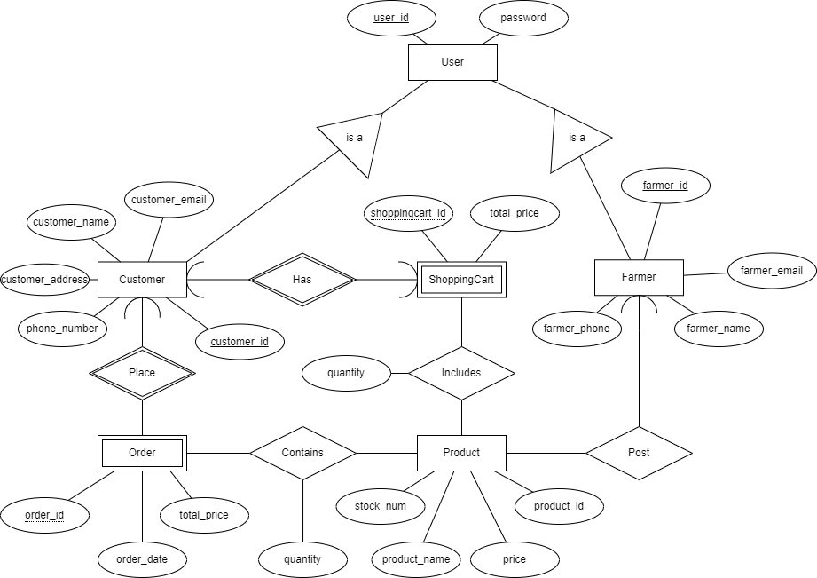

**ER diagram:**



**Schema:**

```
User(user_id: INT[PK], password: VARCHAR(50))

Farmer(farmer_id: INT[PK], user_id: INT[FK to User.user_id], farmer_name: VARCHAR(50), farmer_email: VARCHAR(100), farmer_phone: REAL)

Customer(customer_id: INT[PK], user_id: INT[FK to User.user_id], customer_name: VARCHAR(50), customer_email: VARCHAR(100), customer_address: VARCHAR(100), customer_phone: REAL)

Product(product_id: INT[PK],product_name: VARCHAR(30), price: REAL, stock_num: INT, farmer_id: INT [FK to Farmer.farmer_id])

Has_ShoppingCart(customer_id: INT [PK, FK to Customer.customer_id], shoppingcart_id: INT[PK], total_price: REAL)

Includes_Product(shoppingcart_id: INT [PK, FK to Has_ShoppingCart.shoppingcart_id], customer_id: INT[PK, FK to Has_ShoppingCart.customer_id], product_id: INT[PK, FK to Product.product_id], quantity: INT)

Contains(product_id: INT [PK, FK to Product.product_id], order_id: INT[PK, FK to Order.order_id], quantity: INT)

Place_Order(customer_id: INT[PK, FK to Customer.customer_id], order_id: INT[PK], order_date: DATE, total_price: REAL, order_date: DATE)
```

**Assumption for question 5:**

A Customer has only one customer_id, customer_email, customer_name, customer_address, and phone_number.

An User has only one user_id, and one password.

A farmer has only one farmer_id, farmer_email, farmer_name, farmer_address, and farmer_phone.

A Product has only one product_id, and product_name. The price can never exceed $100, and the stock_num can never exceed 100.

An Order has only one order_id. The order_date should be within a week before the pick up date. The total_price can never exceed $10,000.

A ShoppingCart has only one shoppingcart_id, and total_price can never exceed $10,000

**Description for question 6:**

A Customer or a Farmer is a User.

A Customer has exactly one ShoppingCart, and a ShoppingCart only belongs to exactly one Customer. (Customer to ShoppingCart is one to one)

A Farmer can post many Products, but a Product can only be posted by a Farmer.(Farmer to Product is one to many)

A Customer places many Orders and an Order can only be placed by exactly one Customer. (Customer to Order is one to many)

An Order has at least one product and a Product belongs to many Orders. (Order to Product is many to many)

A ShoppingCart can have multiple Products and a Product can be in many ShoppingCart. (ShoppingCart to Product is many in many)
