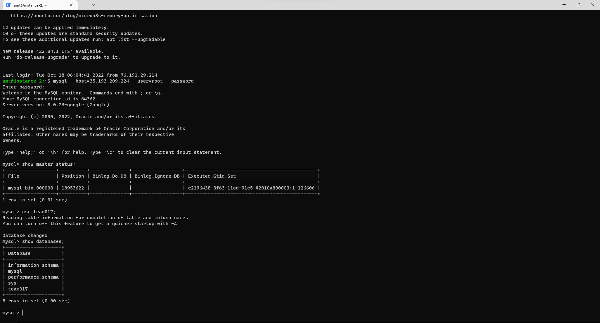

# Database Design

## GCP database



## DDL

```mysql
CREATE TABLE `Customer` (
  `customer_id` int NOT NULL,
  `user_id` int NOT NULL,
  `customer_name` varchar(50) NOT NULL,
  `customer_email` varchar(100) NOT NULL,
  `customer_address` varchar(100) DEFAULT NULL,
  `customer_phone` double DEFAULT NULL,
  PRIMARY KEY (`customer_id`),
  UNIQUE KEY `customer_email_UNIQUE` (`customer_email`),
  KEY `user_id_idx` (`user_id`),
  CONSTRAINT `user_id1` FOREIGN KEY (`user_id`) REFERENCES `User` (`user_id`) ON DELETE CASCADE ON UPDATE CASCADE
);
```

```mysql
 CREATE TABLE `Farmer` (
  `farmer_id` int NOT NULL,
  `user_id` int NOT NULL,
  `farmer_name` varchar(50) NOT NULL,
  `farmer_email` varchar(100) NOT NULL,
  `farmer_phone` double NOT NULL,
  PRIMARY KEY (`farmer_id`),
  UNIQUE KEY `farmer_id_UNIQUE` (`farmer_id`),
  UNIQUE KEY `farmer_email_UNIQUE` (`farmer_email`),
  UNIQUE KEY `farmer_phone_UNIQUE` (`farmer_phone`),
  KEY `user_id_idx` (`user_id`),
  KEY `name` (`farmer_name`),
  CONSTRAINT `user_id` FOREIGN KEY (`user_id`) REFERENCES `User` (`user_id`) ON DELETE CASCADE ON UPDATE CASCADE
) ENGINE=InnoDB DEFAULT CHARSET=utf8mb4 COLLATE=utf8mb4_0900_ai_ci |
```

```mysql
CREATE TABLE `Product` (
  `product_id` int NOT NULL,
  `product_name` varchar(1000) NOT NULL,
  `product_price` double NOT NULL,
  `stock_num` int NOT NULL,
  `farmer_id` int NOT NULL,
  `product_description` varchar(5000) DEFAULT NULL,
  PRIMARY KEY (`product_id`),
  KEY `farmerid` (`farmer_id`),
  KEY `id` (`product_id`),
  KEY `product_price` (`product_price`),
  CONSTRAINT `farmerid` FOREIGN KEY (`farmer_id`) REFERENCES `Farmer` (`farmer_id`) ON DELETE CASCADE ON UPDATE CASCADE
);
```

```mysql
CREATE TABLE `User` (
  `user_id` int NOT NULL,
  `password` varchar(50) NOT NULL,
  PRIMARY KEY (`user_id`),
  UNIQUE KEY `user_id_UNIQUE` (`user_id`)
);
```

```mysql
CREATE TABLE `Product` (
  `product_id` int NOT NULL,
  `product_name` varchar(1000) NOT NULL,
  `product_price` double NOT NULL,
  `stock_num` int NOT NULL,
  `farmer_id` int NOT NULL,
  `product_description` varchar(5000) DEFAULT NULL,
  PRIMARY KEY (`product_id`),
  KEY `farmerid` (`farmer_id`),
  KEY `id` (`product_id`),
  KEY `product_price` (`product_price`),
  CONSTRAINT `farmerid` FOREIGN KEY (`farmer_id`) REFERENCES `Farmer` (`farmer_id`) ON DELETE CASCADE ON UPDATE CASCADE
);
```

```mysql
CREATE TABLE `Has_ShoppingCart` (
  `cart_customer_id` int NOT NULL,
  `shoppingcart_id` int NOT NULL,
  `total_price` double DEFAULT NULL,
  PRIMARY KEY (`shoppingcart_id`,`cart_customer_id`),
  KEY `Has_ShoppingCart_ibfk_1` (`cart_customer_id`),
  CONSTRAINT `Has_ShoppingCart_ibfk_1` FOREIGN KEY (`cart_customer_id`) REFERENCES `Customer` (`customer_id`) ON DELETE CASCADE ON UPDATE CASCADE
);
```

```mysql
CREATE TABLE `Contains` (
  `product_id` int NOT NULL,
  `order_id` int NOT NULL,
  `quantity` int DEFAULT NULL,
  PRIMARY KEY (`product_id`,`order_id`),
  KEY `orderid_5_idx` (`order_id`),
  CONSTRAINT `orderid_5` FOREIGN KEY (`order_id`) REFERENCES `Place_Order` (`order_id`) ON DELETE CASCADE ON UPDATE CASCADE,
  CONSTRAINT `productid_6` FOREIGN KEY (`product_id`) REFERENCES `Product` (`product_id`) ON DELETE CASCADE ON UPDATE CASCADE
);
```

```mysql
CREATE TABLE `Includes_Product` (
  `shoppingcart_id` int NOT NULL,
  `customer_id` int NOT NULL,
  `product_id` int NOT NULL,
  `quantity` int DEFAULT NULL,
  PRIMARY KEY (`shoppingcart_id`,`customer_id`,`product_id`),
  KEY `customer_1_idx` (`customer_id`),
  KEY `product_1_idx` (`product_id`),
  KEY `shoppingcart_1_idx` (`shoppingcart_id`),
  KEY `cart_1_idx` (`shoppingcart_id`),
  CONSTRAINT `cart_2` FOREIGN KEY (`shoppingcart_id`) REFERENCES `Has_ShoppingCart` (`shoppingcart_id`) ON DELETE CASCADE ON UPDATE CASCADE,
  CONSTRAINT `customerid_3` FOREIGN KEY (`customer_id`) REFERENCES `Customer` (`customer_id`) ON DELETE CASCADE ON UPDATE CASCADE,
  CONSTRAINT `prod_3` FOREIGN KEY (`product_id`) REFERENCES `Product` (`product_id`) ON DELETE CASCADE ON UPDATE CASCADE
);
```

```mysql
CREATE TABLE `Place_Order` (
  `order_id` int NOT NULL,
  `customer_id` int NOT NULL,
  `order_date` date DEFAULT NULL,
  `price` float DEFAULT NULL,
  PRIMARY KEY (`order_id`,`customer_id`),
  KEY `customerid_4_idx` (`customer_id`),
  CONSTRAINT `customerid_4` FOREIGN KEY (`customer_id`) REFERENCES `Customer` (`customer_id`) ON DELETE CASCADE ON UPDATE CASCADE
);
```

## Insert


The data from Product is real data that crawled from Walmart, and the data from Farmer, Customer and User are generated randomly.

## Advanced Queries Analysis

### Query 1

```mysql
SELECT farmer_name,farmer_id,product_name,product_price FROM Product NATURAL JOIN Farmer
JOIN(SELECT farmer_id,AVG(product_price) AS avg_price FROM Product GROUP BY farmer_id) AS p USING(farmer_id)
WHERE product_price>avg_price ORDER BY farmer_name;
```

#### No index:

#### 

This query is to find the product which has a higher price than the average product price by selecting farmer_name, farmer_id, product_name, and product_price from Product, Farmer, and p tables. We can see that the index used here is only the default one focused on the primary key.

#### On product_price:

#### 

We add an index here on the stock_num attribute, which is in the WHERE clause. It is strange though we found that the index was not used in this query. At the same time, as the data volume in our table is too small, we are not able to improve the time-performance using the index.

#### On stock_num:


We add another index on stock_num in the Product table, and from the screenshot, we can see that this index is not used when the query is executed. So it did not improve the performance either. If we have a large amount of data, this index should improve the performance though.

#### On farmer_name:


We add another index on famer_name on the table Farmer. This index wasn’t used either, so the consequence is similar to the original one.

#### Result:


According to our query experiments, we did not see any difference when we are setting up indexes. First, we set up the index on product_price and we expect the database to use this index when filtering or in the condition we set up. However, the explain analyze did not show any differences and it still use the default index in the table. On the other hand, two indexes set up in attributes
farmer_name, stock_num did not affect the query performance because these attributes are not relate to our query.


### Query 2

```mysql
SELECT farmer_name,farmer_id,COUNT(product_id) FROM Farmer NATURAL JOIN Product WHERE stock_num<=50 GROUP BY farmer_id;
```

#### No Index:


This query helps us to create a list of farmers who had some products that are in really low stock. After creating the table, we can notify farmers to increase the stock number of products. We can see that there’s no index used here.

#### Index on stock number:


In this query, we set up the index on stock_num. Although compared to the original query, the screenshot provided above, the execution time did not provide large differences, we can see in explanation analysis, the query uses the index to scan the range of stock number lower than 50. We found out that the index did not make the difference in execution time for the reason that the number of data is too small so when querying data, it makes no difference.

#### Index on farmer name:


According to the screenshot, we set up the index on farmer_name. We can see that in the analysis, the index is not being used because we did not use farmer_name as a filter or in the aggregation. If we filter farmer_name in our query, I think the index may affect our execution time to help us improve the performance of the query.

#### Index on product_price:


We set up the index on the product_price column. There are no significant differences because the product_price is not the filter in the query. According to the output, the sql uses the farmer_id as the default index instead of product_price.

#### Result:


From the query we set up indexes in different columns, and the index may have chance to improve query performance in attributes in filters and we can see the query did use the index we set up. However, the data size of our table is too small to see the execution time difference. 

### Query 3

```mysql
SELECT COUNT(order_id),customer_name FROM Place_Order NATURAL JOIN Customer WHERE customer_id=#{customer_id}
```

We didn't implement query 1 as an advanced query. Instead, we use query 3 as another advanced query. So the advanced query we implemented are query 2 and query 3.

### Summary
In conclusion, there are approximately one thousand rows for each table in our database, the index may not affect our query performance. Also, reference from MySQL, the link of [Full Table Scan](https://dev.mysql.com/doc/refman/8.0/en/table-scan-avoidance.html), another reason is that the table size is not big enough that has faster performance on table scan than using a key lookup. This is common for tables with fewer than 10 rows and a short row length. Thus, we think this is the main reason for the index does not work well in our experiments.
